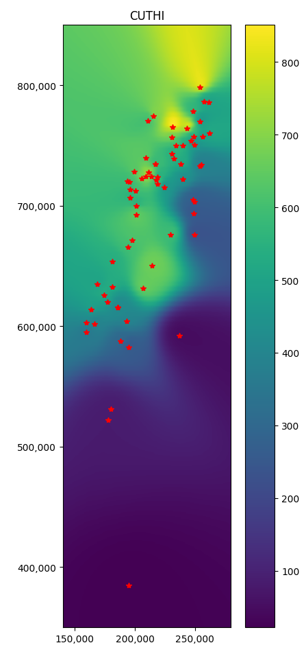

# CUTHI
“Clusters Unifying Through Hiding” Interpolation  (CUTHI)

An addition to IDW interpolation that improves accuracy and eliminates the bull's-eye effect.

You can easily add additional weights to the interpolation, for example, land use. If you can't do it on your own, you can add an issue and I will add this option.

*Don't forget to cite us:*\
Benmoshe, N. (2025). A Simple Solution for the Inverse Distance Weighting Interpolation (IDW) Clustering Problem. Sci, 7(1), 30. https://doi.org/10.3390/sci7010030

# Download IDW and CUTHI
* Python: Look at the [cuthi.ipynb](cuthi.ipynb) to copy the function code and the example code.
* C: Look at the [cuthi.c](cuthi.c) to copy the function code and the example code.

# Compare
CUTHI's accuracy is higher when there are a large number of stations (over twenty) thanks to the new weight that handles inhomogeneous spatial distribution of stations. This method also handles the bull's-eye effect created in IDW.

CUTHI and IDW accuracy (coefficient of determination) as a function of amount of stations

